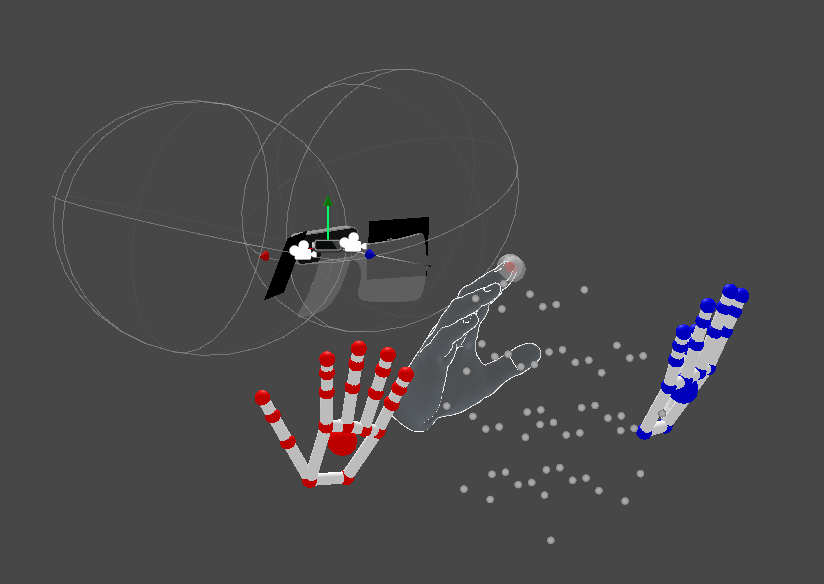

# NorthStarToolbox
 Scripts and tools that help service Project North Star AR glasses

## Leap Positioning Tool

After optical calibration the Leap Motion sensor data needs to be aligned with the AR optics space.

### Instructions:

1) Copy North Star calibration file to StreamingAssets folder, click "Load JSON"

2) Align finger tips (index and middle) with red spheres, press "space bar" to collect sample point. Skip ambiguous poses by hiding your right hand before pressing "space bar"

3) Capture about 10 samples, click "Calibrate data" or 'S' key. This automatically positions the Leap device. Verify by comparing with debug hands. Make small adjustments or capture new data.

4) Click "Save copy" to create a new version with adjusted values.
New file will be saved inside the "Calibrations" folder.